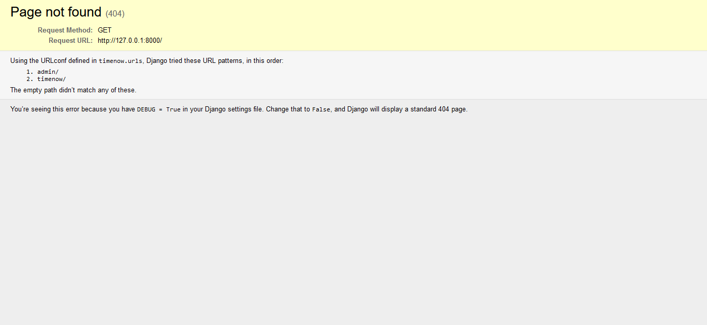
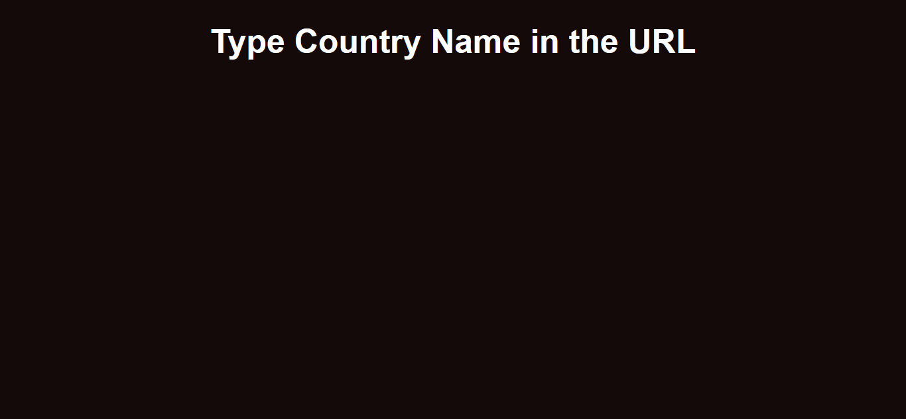
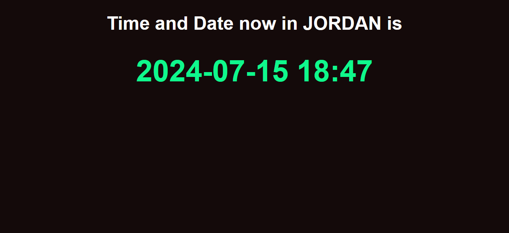

# django-intro

- to run the app use the command`python3 manage.py runserver`
- the first page will be the project page 

- type `/timenow/` in the URL input to be headed to the main APP page

- in the URL type one of the counties (jordan/usa/japan/uae/australia/uk)

